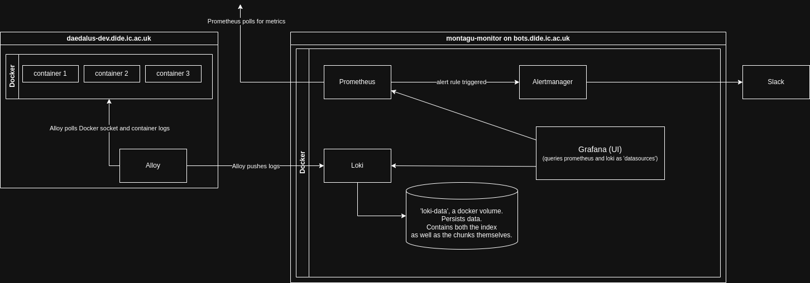

# Montagu monitor

Monitoring and alerts for Montagu and other services.

We should consider separating out the Montagu-specific bits.

This repo has a Docker Compose configuration that spins up:
- a [Prometheus](https://prometheus.io/) instance, which ingests metrics data;
- an [Alertmanager](https://prometheus.io/docs/alerting/latest/alertmanager/) instance;
- a [Loki](https://grafana.com/docs/loki/latest/) instance, which ingests log streams;
- a [Grafana](https://grafana.com/docs/grafana/latest/) instance, which provides a UI to explore the Prometheus and Loki data sources.

These instances are configured by:

* `config/prometheus/prometheus.yml` - Prometheus config (see [docs](https://prometheus.io/docs/prometheus/latest/configuration/configuration/))
* `config/alertmanager/alertmanager.yml` - Alertmanager config. This controls where alerts get posted to (see [docs](https://prometheus.io/docs/alerting/configuration/))
* `config/prometheus/alert-rules.yml` - What Prometheus conditions should trigger alerts (see [docs](https://prometheus.io/docs/prometheus/latest/configuration/alerting_rules/))
* `config/loki/loki-config.yml` - Loki config (see [docs](https://grafana.com/docs/loki/latest/configure/))
* `config/grafana/datasource.yml` - Config telling Grafana where to find the Prometheus and Loki endpoints

On production, to reload all services after a config change, run
```sh
./reload
```

## Local development

```sh
git clone git@github.com:vimc/montagu-monitor.git
cd montagu-monitor
git submodule update
```

### Install python packages

On Ubuntu 22:

```sh
pip3 install -r requirements.txt --user
```

On Ubuntu 24, you will need to first create and activate a virtual environment before installing the packages, e.g.:

```sh
cd montagu-monitor
python3 -m venv .venv
source .venv/bin/activate
pip3 install -r requirements.txt
```

### Run

To run locally and have the alert manager notify a test Slack channel rather than creating noise in
the real monitor channel, use
```sh
./run --dev
```

and for reloading after a config change:
```sh
./reload --dev
```

To force alerts to fire just invert the rules in `prometheus/alert-rules.yml` temporarily, e.g. change a rule expression
like

`up{job="proxy-metrics"} == 0`

to

`up{job="proxy-metrics"} == 1`

### Grafana dashboard

Go to http://localhost:3000/grafana/ to see the Grafana dashboard.

Log in using the user `admin` and the password from Vault under `secret/vimc/prometheus/grafana_password`.

You should be able to inspect metrics under 'Drilldown'.

There will not be any logs to display until you stream some to Loki (see below).

### Stream logs to Loki from a VM in local development

If you are working on Loki locally you will want to receive some log streams for testing.

One way to stream logs in local development is to run a dockerized application on a local VM (or just on metal), and use [Alloy](https://grafana.com/docs/alloy/latest/) to collect and push the Docker logs.

1. If you plan to run your Docker container(s) inside a VM, create the VM with a generous disk space allotment, e.g. 40GB. It's handy to use an OS with a GUI so that you can use the Alloy debugging UI if necessary.
1. Install [reside-ic/infra-scripts](https://github.com/reside-ic/infra-scripts), [uv](https://docs.astral.sh/uv/getting-started/installation/), and [docker](https://docs.docker.com/engine/install/) onto the Alloy host (that is, wherever the Docker containers are going to run, e.g. inside your VM).
1. From the Alloy host, install Alloy locally with infra-scripts. Once you have set the `loki_host_dev` variable, run: `uv run pyinfra @local infra.tasks:install_alloy`
1. Generate some logs in the containers, e.g. by running them.
1. Check you can see the new logs in the Grafana dashboard under 'Drilldown'.

If all is _not_ working as expected, check that Loki is reachable from the Alloy host (outside Alloy). The below command should work, replying either with 'ready' or 'Ingester not ready'. Replace `{{ loki_host }}` with the Loki host address relative to the Alloy host: e.g. `localhost` if running Alloy on-metal, or the gateway IP from the VM. (You can find the VM's gateway IP by running `ip -4 route show default | awk '{print $3; exit}'` if the VM is using NAT networking. If you are using bridge networking, you need the LAN IP instead.):

```sh
curl -v -k --insecure "https://{{ loki_host }}/loki/ready"
```

The `/ready` endpoint does not require basic auth credentials, per the nginx configuration. `-k --insecure` tells curl to skip SSL self-signed certificate warnings.

## Deployment on bots.dide.ic.ac.uk

Connect as the `vagrant` user on `bots.dide.ic.ac.uk`, then

```
# git clone --recursive https://github.com/vimc/montagu-monitor monitor
cd ~/monitor
git pull
pip3 install --user -r requirements.txt
```

And then either call `./run` (if there are code changes) or `./reload` (to
refresh the config).

## Metric exporters

Prometheus relies on the services it is monitoring serving up a text file that
exports values to monitor. By convention, these are served at
`SERVICE_URL/metrics`, and each line follows this syntax:

```
<metric name>{<label name>=<label value>, ...} <metric value>
```

The intention is that we will add `/metrics` endpoints to our various apps,
either:

* Using existing metrics endpoints built-in to things like Docker Daemon (see
  [list](https://prometheus.io/docs/instrumenting/exporters/#software-exposing-prometheus-metrics))
* Using existing "exporters" that sit alongside in a separate docker container,
  such as the existing Redis exporter in this repo (see [list](https://prometheus.io/docs/instrumenting/exporters/#third-party-exporters))
* Directly integrated into the app (using one of the
  [client libraries](https://prometheus.io/docs/instrumenting/clientlibs/))
* Writing our own exporter to sit alongside as a small Flask app in a separate
  container

Another option, which would go against the existing `/metrics` convention in this repo,
but which would complement our use of [Alloy](https://grafana.com/docs/alloy/latest/) to stream logs, would be to use a [push model](https://prometheus.io/docs/prometheus/latest/storage/#overview),
using Alloy to push metrics to Prometheus ([tutorial](https://grafana.com/docs/alloy/latest/tutorials/send-metrics-to-prometheus/)).

### Machine metrics

See [machine-metrics](https://github.com/vimc/machine-metrics) for turning on Prometheus Node Exporter for publishing machine metrics from a system. This will make the metrics accessible on `localhost:9100`. You then need to add a new job to `prometheus.yml` to pull metrics, they can then be used to build alerts or for graphs.

## Loki and Alloy integration

Here is a diagram to provide a sense of the intended architectural set-up of Loki and Alloy in practice, taking an example of having Alloy installed to aggregate logs on the daedalus-dev.dide.ic.ac.uk machine:


